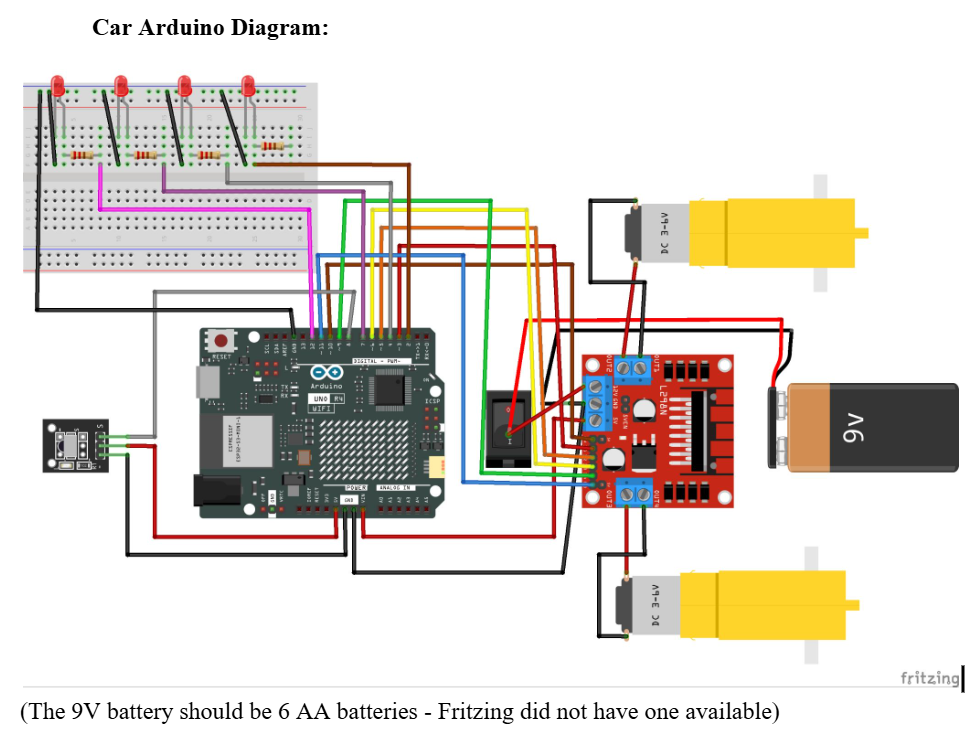

# Arduino-Car

### <ins>Project Summary
This project is an Arduino remote-controlled car. It instructs you how to build the car and provides the code for the functionality of the car. With this code, you will be able to move the car forward, backward, to the left, to the right, and stop the car using an IR remote. It also allows the car to have head/tail lights that can be further customized on your own.

### <ins>Materials Needed
- Arduino R4 Wifi
- 2x DC Motors
- L298N Motor Driver
- IR Receiver Module
- Remote control
- 4x LEDs
- Battery holder for 6 AA batteries
- 6 AA batteries
- 4 220 ohm resistors
- 2x wheels (for the DC motors)
- 1 caster wheel
- On and off switch
- Car chassis 
- Breadboard
- Wires
- Male to female wires

> [!TIP]
> Recommended car kit: [Click here!](https://a.co/d/04TdtWAe) (You would need to replace the battery holder for one that holds 6 batteries)

### <ins>How to Build the Car
Screw the 2 DC motors onto the bottom of the car chassis and attach the wheels. Then screw the caster wheel onto the bottom front end of the chassis. Place the switch onto the chassis so that the switch can be toggled on the bottom of the car. Connect the positive wire from the battery chassis to the bottom of the switch. Additionally, connect another wire to the switch. This wire should have two exposed ends. The wire should be long enough to connect to the L298N Motor Driver. Screw the battery holder onto the top of the chassis, ensuring there is sufficient room for the L298N Motor Driver. Secure the L298N Motor Driver onto the chassis (I used pipe cleaners, but they can also be screwed on). 

Now onto wiring the L298N Motor Driver. Feed the DC motor wires from the bottom of the chassis to the top (through one of the holes). For the left DC motor, place the positive wire into OUT2 and screw it in place, and place the negative wire into OUT1 and screw it in place. Ensure that the wires are secure and will not fall out. For the right DC motor, place the positive wire into OUT3 and screw it in place, and place the negative wire into OUT4 and screw it in place. Also, ensure that the wires are securely in place. Next, place the second wire from the switch into the 12V screw terminal and screw it in place. In the ground screw terminal, place the negative wire from the battery holder, as well as another wire, and screw them in. The second wire should have one exposed end (which is being screwed into the ground screw terminal) and one male end. Finally, place another wire in the 5V screw terminal and screw it in. This wire should also have one exposed end and one male end. 

Next, onto wiring the Arduino. For the next steps, we will be using 6 male to female wires. The female end will be connected to the pins on the L298N Motor Driver, while the male ends will be connected to the digital pins on the Arduino. ENA (the leftmost pin) is connected to pin 10, IN1 to pin 3, IN2 to pin 5, IN3 to pin 6, IN4 to pin 9, and ENB (the rightmost pin) to pin 11. The second negative wire connected to the ground screw terminal will be connected to one of the ground pins on the Arduino. The positive wire from the 5V screw terminal will be connected to the Vin pin on the Arduino.

Then, we will wire the IR Receiver Module. We will be using 3 male to female wires for these next few steps. The female ends will be connected to the pins on the IR Receiver Module, while the male ends will be connected to the Arduino pins. Place one wire on the ground pin of the IR Receiver Module. Then connect the other end to one of the ground pins on the Arduino. Place the second wire on the VCC pin and connect it to the 5V pin on the Arduino. Finally, place the last wire onto the output pin and connect it to pin 8 on the Arduino. 

Finally, we will be wiring the LEDs. Connect the last available ground pin on the Arduino to the negative power rail of the breadboard. Next, place the first LED (red) on the left. Connect the cathode to ground and connect the anode to pin 12 through a 220 ohm resistor. Then place LED 2 (yellow) next to the first LED, connecting the cathode to ground and connecting the anode to pin 7 through a 220 ohm resistor. Then place LED 3 (yellow) next to LED 2, connecting the cathode to ground and connecting the anode to pin 4 through a 220 ohm resistor. Then place LED 4 (red) next to LED 3, connecting the cathode to ground and connecting the anode to pin 2 through a 220 ohm resistor. 

### <ins>How to Run
Before running the code, you must have the Arduino IDE installed.

Download Arduino IDE: [Click here!](https://support.arduino.cc/hc/en-us/articles/360019833020-Download-and-install-Arduino-IDE)

Now onto running the program:

- Connect the Arduino to your laptop
- Make sure to connect to your board on the top left of the IDE
- Verify that the code is working by clicking the verify button with the checkmark on the top left of the IDE
- Once you verify that it is working, click the upload button with the arrow on the top left of the IDE
- Now the code should be uploaded on the Arduino
- Disconnect the the Arduino from your laptop
- Turn on the switch on the bottom of the car
- Turn on the battery holder on the car
- Now you can use the remote to control the car

